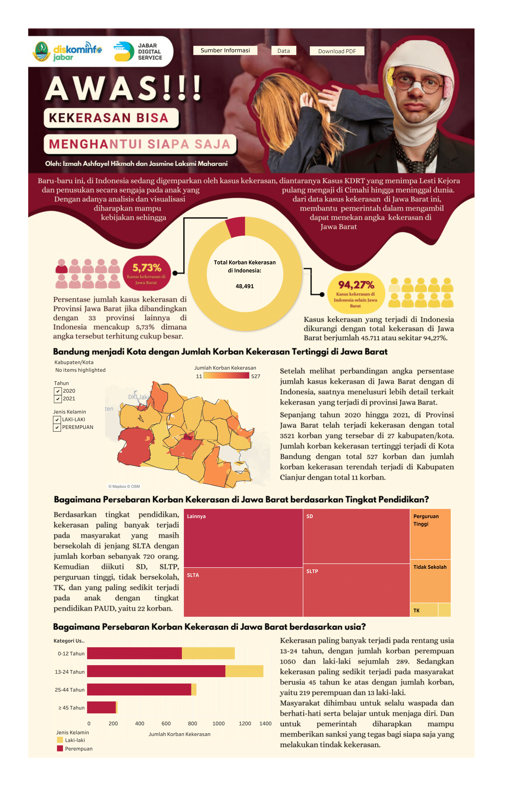

# 📊 Tableau Dashboard - Persebaran Kasus Kekerasan di Jawa Barat (2020-2021)

## 📌 Deskripsi Proyek  
Proyek ini bertujuan untuk memvisualisasikan **persebaran kasus kekerasan di Provinsi Jawa Barat pada tahun 2020-2021** menggunakan **Tableau Public**. Dashboard ini membantu memahami pola kasus berdasarkan **lokasi, jenis kelamin, dan kategori usia korban**. Dengan adanya analisis dan visualisasi ini, diharapkan mampu membantu pemerintah provinsi Jawa Barat dalam mengambil kebijakan sehingga dapat menekan angka kekerasan di provinsi Jawa Barat.

## 📂 Dataset  
- **Sumber Data:** Data kekerasan di Indonesia (2020-2021)
- **Variabel Utama:**
  - **Jumlah korban kekerasan** per kabupaten/kota
  - **Jenis kelamin korban** (Laki-laki/Perempuan)
  - **Kategori usia korban** (0-12 tahun, 13-24 tahun, 25-44 tahun, ≥45 tahun)
  - **Tingkat pendidikan korban** (SD, SLTP, SLTA, Perguruan Tinggi, Tidak Sekolah)

## 📊 Tableau Dashboard  
📌 **Lihat Dashboard di Tableau Public:**  
🔗 **[Lihat di Tableau](https://public.tableau.com/app/profile/jasmeenmhrn/viz/trialnew_16672035663940/Dashboard)**  

## 📸 Cuplikan Dashboard  
  

## 🔍 Insight dari Visualisasi  
- **Total korban kekerasan di Indonesia pada tahun 2020-2021 mencapai 48.491 kasus.**
- **Korban perempuan lebih banyak dibandingkan laki-laki.**
- **Sebagian besar korban berada dalam rentang usia 13-24 tahun.**
- **Kasus kekerasan tersebar di berbagai kabupaten/kota di Jawa Barat, dengan beberapa daerah memiliki angka lebih tinggi dibandingkan lainnya.**
  
## 🛠 Tools yang Digunakan  
- **Tableau Public** untuk visualisasi data.  
- **Microsoft Excel** untuk preprocessing data.  

## 📬 Kontak  
Untuk pertanyaan lebih lanjut, hubungi saya di [LinkedIn](https://www.linkedin.com/in/izmah-ashfayel-hikmah).  
